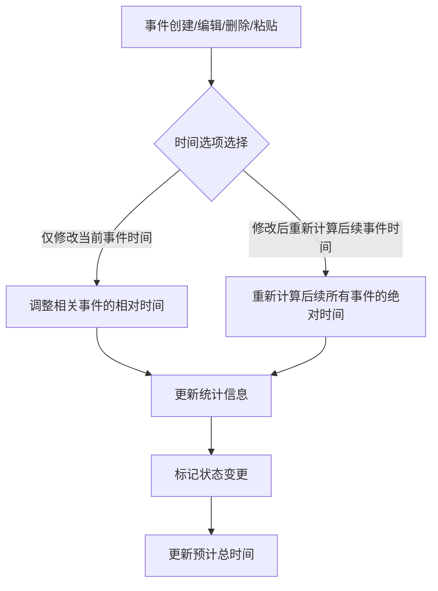

# BetterGI 星轨事件处理逻辑分析报告

## 1. 程序对事件的完整处理流程

### 1.1 事件结构与组成

BetterGI 星轨的事件系统采用表格化管理，每个事件包含以下核心属性：

|属性 |描述 |数据类型 |示例 |
|---|---|---|---|
|序号 |事件在列表中的顺序编号 |整数 |1, 2, 3 |
|事件名称 |事件的中文描述名称 |字符串 |按下回车, 左键按下 |
|事件类型 |事件的分类标识 |字符串 |按键按下, 鼠标移动, 右键释放 |
|键码 |按键事件对应的虚拟键码（Windows VK码） |整数 |13(Enter), 65(A) |
|X坐标 |鼠标事件的X坐标值 |整数 |500, 1024 |
|Y坐标 |鼠标事件的Y坐标值 |整数 |500, 768 |
|相对偏移时间 |相对于前一个事件的时间差（毫秒） |整数 |0, 100, 300 |
|绝对偏移时间 |从零点开始的累计时间（毫秒） |整数 |0, 100, 400 |

### 1.2 事件处理核心流程

事件处理流程主要围绕 `event_manager.py` 中的 `EventManager` 类展开，核心流程如下：



### 1.3 主要事件操作处理

#### 1.3.1 事件创建


1. **触发方式**：通过工具栏按钮、右键菜单或快捷键（Ctrl+I）
2. **处理流程**：
   - 显示事件编辑对话框，用户输入事件属性
   - 根据插入位置计算新事件的时间：
     - 若插入到第一个位置：相对时间为输入值，绝对时间为输入值（相对于零点的累计时间）
     - 若插入到其他位置：相对时间为输入值，绝对时间为前一个事件的绝对时间加上相对时间
   - 根据时间选项决定是否调整后续事件时间
3. **代码位置**：`event_manager.py`（`on_add_event` 方法）

#### 1.3.2 事件编辑


1. **触发方式**：通过工具栏按钮、右键菜单或快捷键（Ctrl+E）
2. **处理流程**：
   - 获取选中事件的当前属性
   - 显示事件编辑对话框，用户修改事件属性
   - 根据修改后的相对时间重新计算当前事件的绝对时间
   - 根据时间选项决定是否调整后续事件时间
3. **代码位置**：`event_manager.py`（`on_edit_event` 方法）

#### 1.3.3 事件删除


1. **触发方式**：通过右键菜单或Delete键
2. **处理流程**：
   - 根据设置决定是否弹出删除选项对话框
   - 执行事件删除操作
   - 若删除的不是末尾事件，根据时间选项决定：
     - 仅调整删除位置后一个事件的相对时间
     - 重新计算后续所有事件的绝对时间
3. **代码位置**：`event_manager.py`（`on_delete_event` 方法）

#### 1.3.4 事件复制粘贴


1. **触发方式**：通过快捷键（Ctrl+C/Ctrl+V）或右键菜单
2. **处理流程**：
   - 复制：将选中事件的完整数据保存到剪贴板
   - 粘贴：
     - 根据设置决定是否弹出粘贴选项对话框
     - 计算粘贴事件的时间：第一个粘贴事件的相对时间为原事件相对时间，绝对时间为前一个事件绝对时间加上相对时间
     - 后续粘贴事件的时间依次累加
     - 根据时间选项决定是否调整后续事件时间
3. **代码位置**：`event_manager.py`（`on_copy_event`、`on_cut_event`、`on_paste_event` 方法）

#### 1.3.5 事件排序


1. **触发方式**：通过工具栏按钮
2. **处理流程**：
   - 提取所有事件数据
   - 按绝对时间对事件进行排序
   - 重新计算每个事件的相对时间：当前事件绝对时间减去前一个事件绝对时间
   - 更新事件序号和时间数据
3. **代码位置**：`event_manager.py`（`sort_events_by_absolute_time` 方法）

## 2. 事件绝对时间的获取与处理机制

### 2.1 绝对时间定义与作用

- **定义**：绝对偏移时间是从执行器开始执行脚本的时间点（零点）开始的累计时间，单位为毫秒
- **作用**：
  - 作为事件排序的主要依据
  - 用于计算事件之间的时间关系
  - 用于生成最终脚本的执行时间
  - 用于时间分析和统计

### 2.2 绝对时间的初始设置

- **零点**：执行器开始执行脚本的时间点，是时间计算的实际基准，绝对时间固定为0毫秒
- **第一个事件**：
  - 绝对时间 = 零点绝对时间（0） + 第一个事件的相对时间
  - 是相对于执行器开始执行时间的第一个实际事件点
- **后续事件**：
  - 创建时：前一个事件的绝对时间 + 当前事件的相对时间
  - 编辑时：根据新的相对时间重新计算
  - 粘贴时：前一个事件的绝对时间 + 当前事件的相对时间

### 2.3 绝对时间的重新计算机制

绝对时间在以下情况下会重新计算：


1. **添加事件**（选择"修改后重新计算后续事件时间"选项）：
   - 从插入位置开始，依次重新计算后续所有事件的绝对时间
   - 计算公式：`当前绝对时间 = 前一个事件绝对时间 + 当前事件相对时间`
   - 代码位置：`event_manager.py`（调用 `recalculate_time_from_row` 方法）
2. **编辑事件**（选择"修改后重新计算后续事件时间"选项）：
   - 从编辑位置开始，依次重新计算后续所有事件的绝对时间
   - 计算公式：`当前绝对时间 = 前一个事件绝对时间 + 当前事件相对时间`
   - 代码位置：`event_manager.py`（调用 `recalculate_time_from_row` 方法）
3. **删除事件**（选择"修改后重新计算后续事件时间"选项）：
   - 从删除位置开始，依次重新计算后续所有事件的绝对时间
   - 计算公式：`当前绝对时间 = 前一个事件绝对时间 + 当前事件相对时间`
   - 代码位置：`event_manager.py`（调用 `recalculate_time_from_row` 方法）
4. **粘贴事件**（选择"修改后重新计算后续事件时间"选项）：
   - 从粘贴位置开始，依次重新计算后续所有事件的绝对时间
   - 计算公式：`当前绝对时间 = 前一个事件绝对时间 + 当前事件相对时间`
   - 代码位置：`event_manager.py`（调用 `recalculate_time_from_row` 方法）
5. **事件排序**：
   - 按绝对时间排序后，重新计算所有事件的相对时间
   - 绝对时间保持不变，但事件顺序重新排列
   - 代码位置：`event_manager.py`（`sort_events_by_absolute_time` 方法）

## 3. 相对时间的生成规则与排序算法

### 3.1 相对时间定义与作用

- **定义**：相对偏移时间是当前事件与前一个事件之间的时间差，单位为毫秒
- **核心关系公式**：
  - `绝对时间(n) = 绝对时间(n-1) + 相对时间(n)`
  - `相对时间(n) = 绝对时间(n) - 绝对时间(n-1)`
- **作用**：
  - 直观反映事件之间的时间间隔
  - 便于手动调整事件间的延迟
  - 用于计算绝对时间

### 3.2 相对时间的生成规则

#### 3.2.1 初始生成

- **新建事件**：用户通过对话框输入相对时间值
- **复制粘贴事件**：继承原事件的相对时间值
- **排序后**：重新计算为相邻事件绝对时间之差

#### 3.2.2 动态调整

相对时间在以下情况下会动态调整：


1. **添加事件**（选择"仅修改当前事件时间"选项）：
   - 只调整插入位置后一个事件的相对时间
   - 计算公式：`新相对时间 = 原绝对时间 - 插入事件的绝对时间`
   - 代码位置：`event_manager.py`
2. **编辑事件**（选择"仅修改当前事件时间"选项）：
   - 只调整编辑位置后一个事件的相对时间
   - 计算公式：`新相对时间 = 后一个事件原绝对时间 - 当前事件新绝对时间`
   - 代码位置：`event_manager.py`
3. **删除事件**（选择"仅修改当前事件时间"选项）：
   - 只调整删除位置后一个事件的相对时间
   - 计算公式：`新相对时间 = 后一个事件原绝对时间 - 删除位置前一个事件绝对时间`
   - 代码位置：`event_manager.py`
4. **粘贴事件**（选择"仅修改当前事件时间"选项）：
   - 只调整粘贴位置后一个事件的相对时间
   - 计算公式：`新相对时间 = 后一个事件绝对时间 - 最后一个粘贴事件绝对时间`
   - 代码位置：`event_manager.py`
5. **重新计算相对时间**：
   - 遍历所有事件，计算当前事件绝对时间与前一个事件绝对时间的差值
   - 计算公式：`相对时间 = 当前事件绝对时间 - 前一个事件绝对时间`
   - 代码位置：`event_manager.py`（`recalculate_relative_times` 方法）

### 3.3 事件排序算法

#### 3.3.1 排序依据

事件排序主要依据绝对偏移时间，采用以下排序规则：


1. 将事件按绝对时间从小到大排序
2. 对于绝对时间相同的事件，保持原有的相对顺序
3. 排序后重新计算所有事件的相对时间
4. 更新事件的序号

#### 3.3.2 排序实现

排序算法的核心实现如下：

```python
# 获取所有事件数据
events = []
for row in range(self.events_table.rowCount()):
    event_data = []
    for col in range(self.events_table.columnCount()):
        item = self.events_table.item(row, col)
        event_data.append(item.text() if item else "")
    events.append(event_data)

# 按绝对时间排序
events.sort(key=lambda x: int(x[7]) if x[7].isdigit() else 0)

# 重新计算相对时间并插入
prev_absolute_time = 0  # 排序时以零点（执行器开始执行脚本的时间点）为基准
for i, event in enumerate(events):
    # 获取当前事件的绝对时间
    current_absolute_time = int(event[7]) if event[7].isdigit() else 0
    
    # 计算新的相对时间：当前事件绝对时间 - 前一个事件绝对时间（或零点）
    relative_time = current_absolute_time - prev_absolute_time
    
    # 更新事件数据
    event[0] = str(i + 1)  # 更新行号
    event[6] = str(relative_time)  # 更新相对时间
    # 绝对时间保持不变
    
    # 插入事件
    self.add_table_row(event)
    
    # 更新前一个绝对时间为当前绝对时间
    prev_absolute_time = current_absolute_time
```

**代码位置**：`event_manager.py`（`sort_events_by_absolute_time` 方法）

## 4. 时间数据的存储格式与更新策略

### 4.1 存储格式

#### 4.1.1 内存存储

事件数据在内存中以表格形式存储，每个事件作为表格的一行：

- **数据类型**：所有数据均以字符串形式存储在 `QTableWidgetItem` 中
- **时间精度**：毫秒级精度
- **存储结构**：
  - 列0：序号（字符串形式的整数）
  - 列1：事件名称
  - 列2：事件类型
  - 列3：键码
  - 列4：X坐标
  - 列5：Y坐标
  - 列6：相对偏移时间（字符串形式的整数，单位：毫秒）
  - 列7：绝对偏移时间（字符串形式的整数，单位：毫秒）

#### 4.1.2 文件存储

当项目保存到文件时，事件数据以JSON格式存储，示例结构：

```json
{
  "macroEvents": [
    {
      "type": 0,
      "mouseX": 100,
      "mouseY": 200,
      "time": 100,
      "keyCode": 13
    },
    {
      "type": 1,
      "mouseX": 100,
      "mouseY": 200,
      "time": 300,
      "keyCode": 13
    },
    {
      "type": 2,
      "mouseX": 300,
      "mouseY": 400,
      "time": 500
    },
    {
      "type": 4,
      "mouseX": 500,
      "mouseY": 600,
      "time": 700,
      "mouseButton": "Left"
    },
    {
      "type": 5,
      "mouseX": 500,
      "mouseY": 600,
      "time": 900,
      "mouseButton": "Left"
    },
    {
      "type": 4,
      "mouseX": 700,
      "mouseY": 800,
      "time": 1100,
      "mouseButton": "Right"
    },
    {
      "type": 5,
      "mouseX": 700,
      "mouseY": 800,
      "time": 1300,
      "mouseButton": "Right"
    },
    {
      "type": 4,
      "mouseX": 900,
      "mouseY": 1000,
      "time": 1500,
      "mouseButton": "Middle"
    },
    {
      "type": 5,
      "mouseX": 900,
      "mouseY": 1000,
      "time": 1700,
      "mouseButton": "Middle"
    },
    {
      "type": 6,
      "mouseX": 0,
      "mouseY": 120,
      "time": 1900
    },
    {
      "type": 6,
      "mouseX": 0,
      "mouseY": -120,
      "time": 2100
    }
  ],
  "info": {
    "description": "由BetterGI StellTrack创建",
    "x": 0,
    "y": 0,
    "width": 1920,
    "height": 1080,
    "recordDpi": 1.0
  }
}
```

**数据格式说明**：


1. **顶层结构**：
   - `macroEvents`：事件数组，包含所有事件数据
   - `info`：脚本信息，包含描述、屏幕分辨率等元数据
2. **事件对象字段**：
   - `type`：事件类型数字（0-按键按下, 1-按键释放, 2-鼠标移动, 4-鼠标按下, 5-鼠标释放, 6-鼠标滚轮）
   - `mouseX`：鼠标X坐标（整数，鼠标滚轮事件固定为0）
   - `mouseY`：
     - 普通鼠标事件：鼠标Y坐标（整数）
     - 鼠标滚轮事件：滚动值（整数，正数向上滚动，负数向下滚动）
   - `time`：事件的绝对偏移时间（毫秒，整数）
   - `keyCode`：按键事件的键码（可选，整数，仅键盘事件）
   - `mouseButton`：鼠标按钮（可选，字符串，Left/Right/Middle，仅鼠标点击事件）
3. **脚本信息字段**：
   - `description`：脚本描述文本
   - `x`, `y`：脚本录制区域左上角坐标
   - `width`, `height`：脚本录制区域分辨率
   - `recordDpi`：录制时的DPI缩放比例

**存储逻辑**：

```python
# 实际脚本生成逻辑（script_manager.py:25-131）
events = []
for row in range(events_table.rowCount()):
    event_data = get_event_data_from_table(events_table, row)
    if event_data[0]:  # 如果事件名称不为空
        # 转换为脚本格式
        event_type_num = convert_event_type_str_to_num(event_data[1])
        script_event = {
            "type": event_type_num,
            "mouseX": int(event_data[3]) if event_data[3] else 0,
            "mouseY": int(event_data[4]) if event_data[4] else 0,
            "time": int(event_data[6]) if event_data[6] else 0  # 使用绝对偏移时间
        }
        # 根据事件类型添加额外字段
        if event_data[1] in ["按键按下", "按键释放"] and event_data[2]:
            script_event["keyCode"] = int(event_data[2])
        # ... 鼠标事件处理
        events.append(script_event)

# 完整脚本结构
script = {
    "macroEvents": events,
    "info": {
        "description": "由BetterGI StellTrack创建",
        "x": 0,
        "y": 0,
        "width": width,
        "height": height,
        "recordDpi": record_dpi
    }
}
```

### 4.2 更新策略

#### 4.2.1 实时更新机制

- **批量操作标志**：通过 `_batch_operation` 标志优化批量操作时的UI更新
- **状态脏标记**：通过 `mark_state_dirty` 方法标记项目已修改
- **统计信息更新**：事件操作后调用 `update_stats` 方法更新统计信息
- **预计总时间更新**：事件操作后调用 `on_calculate_total_time` 方法更新预计总时间

#### 4.2.2 时间计算优化

- **最小化计算范围**：仅重新计算必要的事件时间，而非全部事件
- **批量更新**：禁用中间重绘，提高批量操作性能
- **延迟更新**：复杂操作时先完成数据处理，最后统一更新UI

#### 4.2.3 撤销/重做支持

- **状态保存**：每个事件操作前，将当前状态保存到撤销栈
- **状态恢复**：撤销/重做时，从栈中恢复完整的事件数据（包括时间信息）
- **批量操作处理**：批量操作视为一个整体，统一保存和恢复

## 5. 时间处理的特殊情况与边界条件

### 5.1 负数时间处理

- **检测机制**：当相对时间计算结果为负数时，UI会显示提示信息："💡 提示：为避免计算出现异常，若添加事件、编辑事件、粘贴事件后相对时间出现负数，请点击'事件排序'"
- **根本原因**：当事件顺序与绝对时间顺序不一致时，可能导致相对时间计算出现负数
- **解决方案**：通过"事件排序"功能重新计算所有事件的相对时间，以零点（执行器开始执行脚本的时间点）为基准重新组织事件顺序
- **预防措施**：在操作提示中建议用户在出现负数时间时使用排序功能

### 5.2 大量事件处理

- **性能优化**：采用批量添加行的方式，减少UI重绘次数
- **内存管理**：仅在需要时加载和处理事件数据
- **UI响应**：长时间操作时保持UI响应，通过后台计算实现

### 5.3 时间精度与范围

- **精度**：毫秒级精度，满足大多数自动化脚本需求
- **范围**：支持从0到999999毫秒的时间范围
- **溢出处理**：通过输入验证防止超出范围的值

## 6. 时间分析功能

BetterGI 星轨还提供了事件时间分析功能，用于分析特定事件序列的时间特性：

- **分析对象**：排除鼠标移动事件，仅分析其他事件
- **分析指标**：
  - 总时间：选定事件序列的总持续时间
  - 平均时间：每次序列执行的平均时间
  - 重复次数：序列执行的次数
- **应用场景**：
  - 分析重复操作的时间稳定性
  - 优化特定操作序列的执行效率
  - 调试复杂事件链的时间问题

## 7. 代码优化建议

### 7.1 时间处理相关优化


1. **添加时间验证机制**：在输入时直接验证相对时间的合理性，防止负数时间产生
2. **优化排序算法**：对于大量事件，考虑使用更高效的排序算法
3. **添加时间可视化**：增加时间轴视图，直观展示事件的时间分布
4. **增强批量编辑功能**：支持更复杂的时间批量调整规则

### 7.2 性能优化


1. **延迟计算机制**：对于大量事件，考虑使用延迟计算绝对时间的机制
2. **缓存计算结果**：缓存常用的时间计算结果，减少重复计算
3. **异步处理**：对于复杂的时间计算，考虑使用异步处理，避免UI阻塞

## 8. 总结

BetterGI 星轨的事件处理系统采用了**零点-相对时间-绝对时间**的三层时间管理模型，实现了灵活、高效的事件编排功能。其核心特点包括：


1. **清晰的时间基准体系**：以执行器开始执行脚本的时间点（零点）作为时间基准，所有事件的绝对时间均相对于零点计算，确保时间体系的一致性
2. **灵活的时间调整机制**：支持"仅修改当前事件时间"和"修改后重新计算后续事件时间"两种调整策略，满足不同场景需求
3. **可靠的时间计算逻辑**：通过明确的公式关系（`绝对时间(n) = 绝对时间(n-1) + 相对时间(n)`）确保时间数据的准确性
4. **高效的事件排序算法**：基于绝对时间的排序算法，能够快速重新组织事件顺序并计算相对时间
5. **优化的性能表现**：通过批量操作、最小化计算范围和UI更新优化，提高了系统处理大量事件的能力
6. **友好的用户体验**：提供清晰的操作提示和错误处理机制，帮助用户理解和使用时间管理功能


---

**报告完成时间**：2025-12-10
**分析对象**：BetterGI 星轨 v3.4.1